
 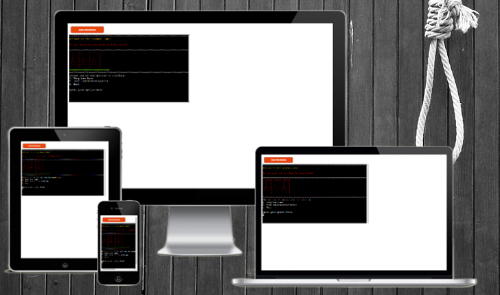 

# The Hangman Game

## by DB

---

---

This is my Portfolio Project 3 (PP3) which is a part of the Code Institute’s Full Stack Software Development Diploma Course. This project demonstrates the skills and knowledge of the Python Programming Language which I have learned during the course.
The project purpose is to build a command-line python application that allows user to manage a common dataset about a particular domain.

#### [Click here to view the site.](https://pp3-hangman-db.herokuapp.com/)
#### [Click here to view the repository.](https://github.com/DominikBBB/PP3-Hangman)

---

# Table of Contents:

1. [Project Overview](#project-overview)
2. [User Experience(UX)](#user-experience-ux)
    - [Target Audience](#target-audience)
    - [Strategy](#strategy)
    - [Scope](#scope)
    - [Structure](#structure)
        - [Flowchart](#flowchart)
    - [Skeleton](#skeleton)
        - [Mockups](#mockups)
    - [Surface](#surface)
        - [Typography](#typography)
3. [Features](#features)
    - [Existing Features](#existing-features)
    - [Future Features](#future-features)
4. [Technologies](#technologies)
    - [Main Languages](#main-languages)
    - [Python Libraries](#python-libraries)
    - [Other Technologies](#other-technologies)
    - [Resources](#Resources)
5. [Testing](#testing)
    1. [Tests](#tests)
        1. Functionality testing
        2. Compatibility testing and Responsiveness
        3. Performance testing
        4. [Visual testing](#visual-testing)
        5. [Funcionality testing](#funcionality-testing)
        6. [Testing User Stories](#testing-user-stories)
    2. [Bugs and Fixes](#bugs-and-fixes)
6. [Deployment](#deployment)
7. [Credits](#credits)
8. [Acknowledgments](#acknowledgments)

---

# Project Overview:

The Hangman Game is a very popular world game. In this application, the user is asked to input their name, and then a random secret word is choosen from a list of words. The user has to guess the word by inputting letters one at a time. If the letter is in the word, it is revealed, but if it is not, the player is penalized with an additional body part in the gallows. If the user correctly guesses full word, the app will ask the player if they want to try to be hanged  again. If the player does not guess the word correctly within the allowed number of guesses, the app will reveal the answer and ask the player if they want to be hanged again. The user has 7 lifes. The application is very easy to navigate for anybody.

[Back to Table Of Contents](#table-of-contents)

---

# User Experience UX:

## Target Audience:

- People of all ages.

[Back to Table Of Contents](#table-of-contents)

## Strategy:

### Business Goals:

1. I want to make that game with user-friendly and intuitive navigation,
2. I want to make sure that the game rules are easily to understand,
3. I want to ensure the game level is average enough to prevent any user from becoming bored,
4. I want user to be able to choose to play again or exit. 

### Customer Goals:

1. I would like the game to be easy to navigate,
2. I would like to easily understand the rules,
3. I would like to enter my name,
4. I would like to be warmed if I put incorrent character,
5. I would like to track the game progress,
6. I would like to have a chance to retake the game.

[Back to Table Of Contents](#table-of-contents)

## Scope:

#### The scope of the hangman game in its first release is defined by the following features:

- a simple, error-free game,
- clean user interface for easy navigation and readability,
- clear program response to the user input,
- non-bulky text. 

#### Features that are to be considered for future releases:

- to choose level of difficulty,
- to be able to enter own word.

[Back to Table Of Contents](#table-of-contents)

## Structure:

### Flowchart

The flow chart showing the logic of the program can be found here:

Flowchart

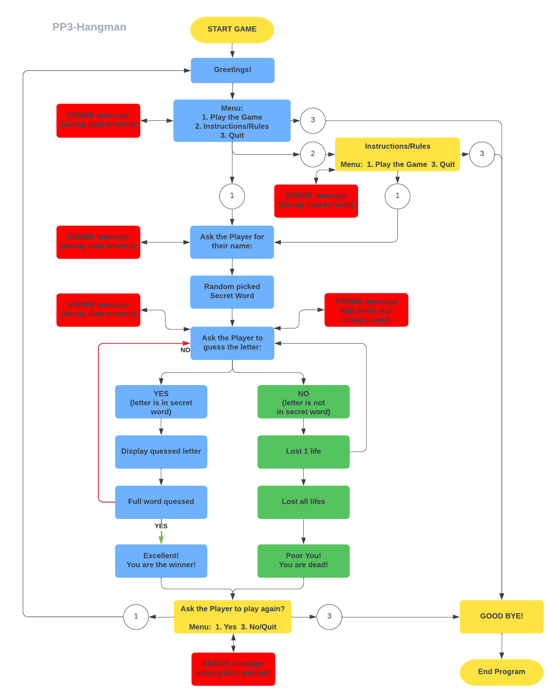

[Back to Table Of Contents](#table-of-contents)

## Skeleton:

### Mockups:

Mockups

[Back to Table Of Contents](#table-of-contents)

## Surface:

### Typography:

Topography in the terminal is very limited. To make the terminal messages more intuitive Colorama colors were introduced. The incorrect answers and gallows are in red, game golden rules in yellow and the grass is green.

[Back to Table Of Contents](#table-of-contents)

---

# Features:

## Existing Features:

1. Main Menu:
    - welcome message is displayed
    - gives user 3 options to select: start the game, read the rules or exit
    - user is prompt to choose only one of these 3 options
    
&nbsp;

    

Main Menu Screenshot 1

    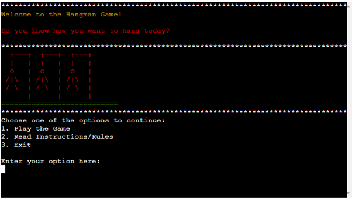

    

    

Main Menu Screenshot 2

    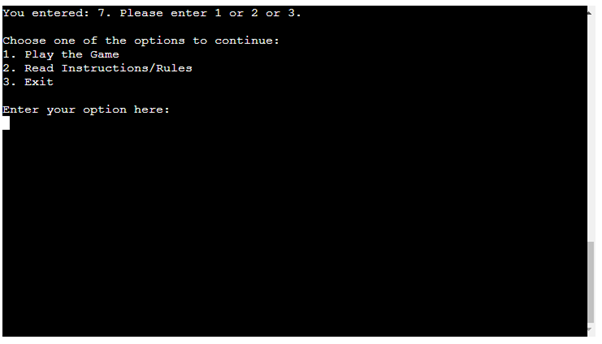

    

    
&nbsp;

2. Player Name:
    - player name input is displayed
    
&nbsp;

    

Player Name Input Screenshot 1

    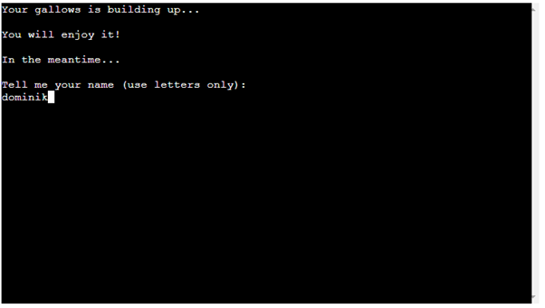

    

    

Player Name Input Screenshot 2

    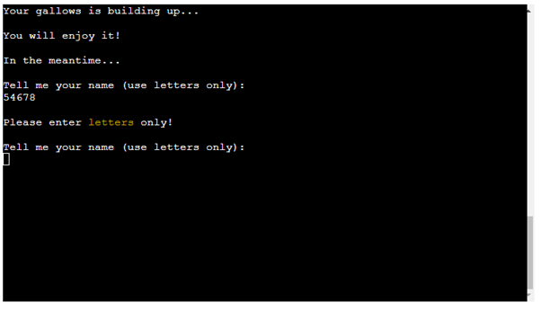

    

    
&nbsp;

3. Instructions / Rules:
    - instructions on how to use the program are displayed
    - gives user 2 options to select: start the game or exit
    - user is prompt to choose only one of these 2 options
    
&nbsp;

    

Instructions Screenshot

    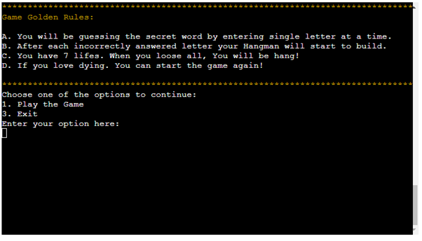

    

    
&nbsp;

4. Enter the letter:
    - ask user to enter the single letter
    
&nbsp;

    

Enter The Letter Screenshot 1

    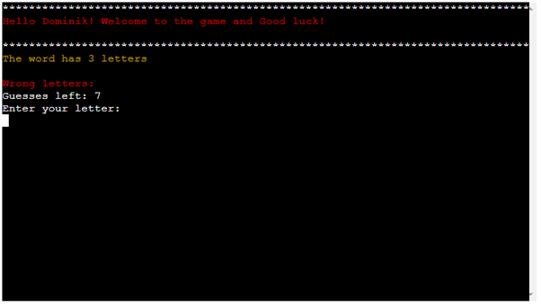

    

    

Enter The Letter Screenshot 2

    

    

    

Enter The Letter Screenshot 3

    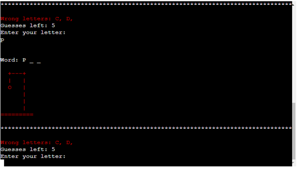

    

    
&nbsp;

5. The end of the game and the game loop
    - message with the end result and secret word
    - ask user if they want to play again or exit
    - user is prompt to choose only one of these 2 options
    
&nbsp;

    

End of the Game Screenshot 1

    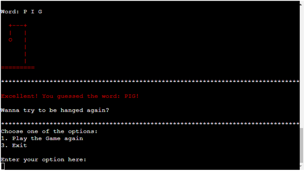

    

    
    

End of the Game Screenshot 2

    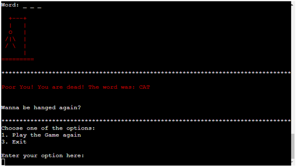

    

    
&nbsp;

6. Exit Game
    - Good bye and good luck message
    
&nbsp;

    

End of the Game Screenshot 2

    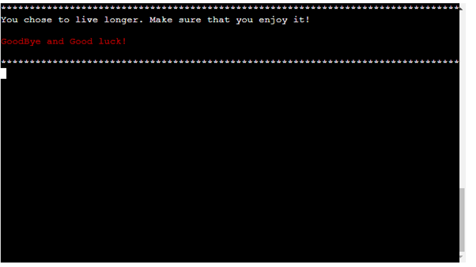

    

    
&nbsp;

## Future Features:

- to choose level of difficulty,
- to be able to enter own word.

[Back to Table Of Contents](#table-of-contents)

---

# Technologies:

## Main Languages:

- [Python](https://en.wikipedia.org/wiki/Python_(programming_language)) - is a high-level, general-purpose programming language,
- [Markdown](https://en.wikipedia.org/wiki/Markdown) - markup language used to write README and TESTING documents.

## Python Libraries:

- [random](https://docs.python.org/3/library/random.html) - built-in python module - used to generate random quote and random book on exit screen,
- [textwrap](https://docs.python.org/3/library/textwrap.html) - built-in python module - used to wrap lines over 79 char to next line e.g. long book description,
- [os](https://docs.python.org/3/library/os.html) - built-in pythod module - used to write clear_terminal function,
- [colorama](https://pypi.org/project/colorama/) - used to color terminal outputs,
- [time&sleep](https://docs.python.org/3/library/time.html) - used to displayed delayed messages in the terminal.

## Other Technologies:

- [Gitpod](https://gitpod.io/) - used to write the project code,
- [Visual Studio Code](https://code.visualstudio.com/) - used to write the project code,
- [Git]() - used for code version control after git-push command to GitHub,
- [GitHub](https://github.com/) - used to store the project's code,
- [Responsive Design](http://ami.responsivedesign.is/) - used to do responsive mockups,
- [LucidChart](https://www.lucidchart.com/) - used to create flow chart diagram,
- [Heroku](https://id.heroku.com/) - online app used to deploy project,
- [CI-Python-Linter](https://pep8ci.herokuapp.com/) - PEP8 Python Validator.

## Resources:

- [Code Institute Course Content](https://learn.codeinstitute.net/dashboard) - Main source of fundamental knowledge,
- [Code Institute SLACK Community](https://slack.com/) - Source of assistance,
- [Wikipedia](https://pl.wikipedia.org/) - Source of history information and images,
- [Grammarly](https://app.grammarly.com/) - help with grammar and typo check,
- [GitHub Community](https://github.com/) - Source of information, solutions and suggestions,
- [Stack Overflow](https://stackoverflow.com/) - Source of knowledge,
- [Flake8 Rules](https://www.flake8rules.com/) - The Big Ol' List of Rules - Python Code Style
- [Python Enhancement Proposals](https://peps.python.org/) - Source of knowledge.

  
[Back to Table Of Contents](#table-of-contents)

---