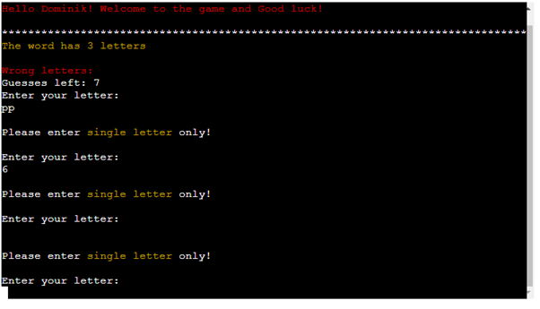
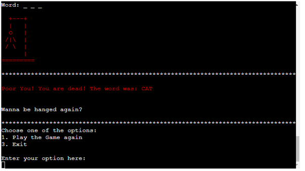
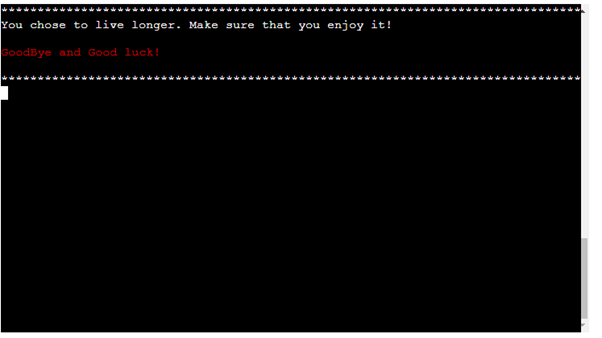

1. Main screen. Input/Output as expected. No bugs found.

| **Feature**   | **Action**                    | **Expected Result**          | **Actual Result** |
| ------------- | ----------------------------- | ---------------------------- | ----------------- |
| Main screen | Select 'Play the Game' | Navigate to new Player Name creation screen | Works as expected |
| Main screen | Select 'Read Instructions/Rules' | Navigate to Game Golden Rules page | Works as expected |
| Main screen | Select 'Exit' | Navigate to Exit page | Works as expected |
| Main screen | Enter any symbol that is not 1 or 2 or 3 | Return the correct error message | Works as expected |

2. Entering Player Name. Input/Output as expected. No bugs found.

| **Feature**   | **Action**                    | **Expected Result**          | **Actual Result** |
| ------------- | ----------------------------- | ---------------------------- | ----------------- |
| New Player Name | Enter new name | Navigate to the game core screen / new letter entry  | Works as expected |
| New Player Name | Enter any symbol that is not alpha | Return the correct error message | Works as expected |

3. Entering the letter. Input/Output as expected. No bugs found.

| **Feature**   | **Action**                    | **Expected Result**          | **Actual Result** |
| ------------- | ----------------------------- | ---------------------------- | ----------------- |
| New letter | Enter isalpha character | Check if the letter is in the secret word or not | Works as expected |
| New letter | Enter any symbol that is not alpha | Return the correct error message | Works as expected |

4. End of the game and game loop. Input/Output as expected. No bugs found.

| **Feature**   | **Action**                    | **Expected Result**          | **Actual Result** |
| ------------- | ----------------------------- | ---------------------------- | ----------------- |
| Main screen | Select 'Play the Game again' | Navigate to Main screen | Works as expected |
| Main screen | Select 'Exit' | Navigate to Exit page | Works as expected |
| Main screen | Enter any symbol that is not 1 or 3 | Return the correct error message | Works as expected |

5. Instructions / Rules. Input/Output as expected. No bugs found.

| **Feature**   | **Action**                    | **Expected Result**          | **Actual Result** |
| ------------- | ----------------------------- | ---------------------------- | ----------------- |
| Rules | Select 'Play the Game' | Navigate to Main screen | Works as expected |
| Rules | Select 'Exit' | Navigate to Exit page | Works as expected |
| Rules | Enter any symbol that is not 1 or 3 | Return the correct error message | Works as expected |

6. Exit the game. Input/Output as expected. No bugs found.

| **Feature**   | **Action**                    | **Expected Result**          | **Actual Result** |
| ------------- | ----------------------------- | ---------------------------- | ----------------- |
| Exit | Wait 5 secs | Navigate to Main screen | Works as expected |

